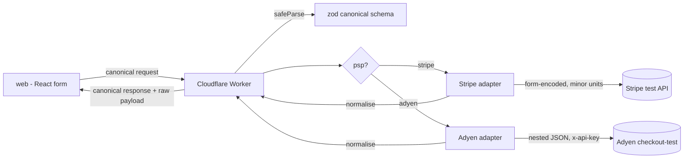

# PSP Orchestrator

A small payments sandbox to show off the adapter / anti-corruption-layer
pattern. You pick a PSP, the form sends one canonical request to a Cloudflare
Worker, and an adapter turns that into the PSP's actual API call, hits their
sandbox, and maps the response back to a canonical result. The UI shows both
the canonical result and the raw PSP payload.

Sandbox only. Everything goes to test environments (Stripe test mode, Adyen
checkout-test) using the providers' documented test cards, so there's no real
card data involved.

## How it works



The route doesn't do anything PSP-specific. It validates the request, picks an
adapter from a registry, and returns the result. All the provider details live
behind the `PspAdapter` interface.

The canonical contract itself (zod schema + inferred types) lives in a
`shared/` workspace imported by both sides, so the web app and the Worker
can't drift apart. The web app only imports the types (and the PSP list),
so zod stays out of the browser bundle.

## Stripe vs Adyen

The two model the same authorisation pretty differently, and the adapters hide
that:

|            | Stripe                            | Adyen                                      |
|------------|-----------------------------------|--------------------------------------------|
| Body       | form-urlencoded, flat             | JSON, nested                               |
| Amount     | `amount=4200` (minor units)       | `amount: { value: 4200, currency: "GBP" }` |
| Currency   | lowercase (`gbp`)                 | uppercase, in the amount object            |
| Auth       | `Authorization: Bearer sk_test_…` | `x-api-key: …`                             |
| Merchant   | implicit in the key               | explicit `merchantAccount`                 |
| Test cards | confirm via a PaymentMethod token | raw card fields accepted                   |

The last row is the interesting one: the same canonical card becomes a token
for Stripe but goes through raw to Adyen.

### Canonical request

```json
{
  "psp": "adyen",
  "amount": 4200,
  "currency": "GBP",
  "card": { "number": "5555555555554444", "expiry": "0330", "cvc": "737", "name": "Brad Test" },
  "reference": "ORD-123",
  "idempotencyKey": "7f0d0f2e-9d3a-4b6c-8a1e-2c5f4d7b9e01"
}
```

### Canonical response

```json
{ "status": "authorised", "pspReference": "8835…", "rawResponse": { /* untouched PSP payload */ } }
```

`status` is one of `authorised | refused | pending | error`, so the UI doesn't
have to know about PSP-specific result codes.

### Idempotency

Every canonical request carries a browser-generated UUID that the Worker
forwards to the PSP as the `Idempotency-Key` header (both Stripe and Adyen
support it natively), so a retried request can never authorise twice. The
key's lifecycle lives in the UI: it stays stable while the outcome is unknown
(a submit that failed in transit, or a canonical `error`), so retrying is
safe, and rotates on any form edit or once an attempt reaches a definitive
outcome — Stripe rejects a reused key with different parameters, and a
deliberate resubmit is a new payment.

## Running locally

Needs Node 24 / npm 11 (see `engines` in `package.json`). npm workspaces, so
install once at the root:

```bash
npm install
```

Worker (needs your own sandbox credentials):

```bash
cd worker
cp .dev.vars.example .dev.vars   # STRIPE_SECRET_KEY, ADYEN_API_KEY, ADYEN_MERCHANT_ACCOUNT
npm run dev                      # http://localhost:8787
```

Web (separate terminal):

```bash
npm run dev:web
```

Set `VITE_WORKER_URL` to point the web build at a deployed Worker.

## Checks

```bash
npm run lint     # eslint + knip + tsc across both packages
npm test         # vitest
npm run build    # web production build
```

## Secrets

`wrangler.jsonc` (Worker name, compatibility date, non-secret vars) is
committed. Secret values are not — set them with `wrangler secret put` and
Cloudflare stores them encrypted. CI deploys with a `CLOUDFLARE_API_TOKEN` (plus
`CLOUDFLARE_ACCOUNT_ID`); the PSP secrets never go into CI.
